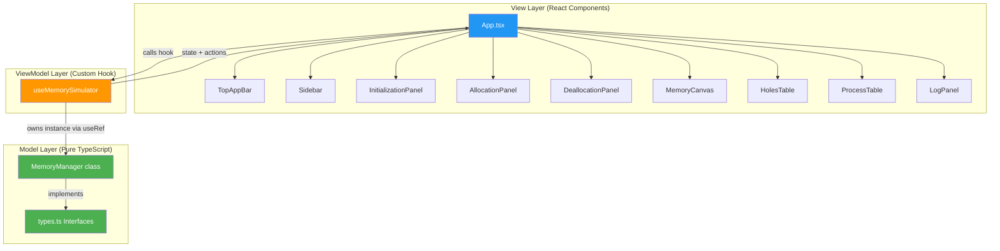
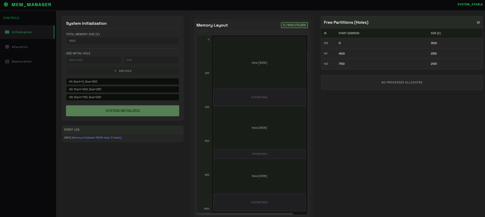
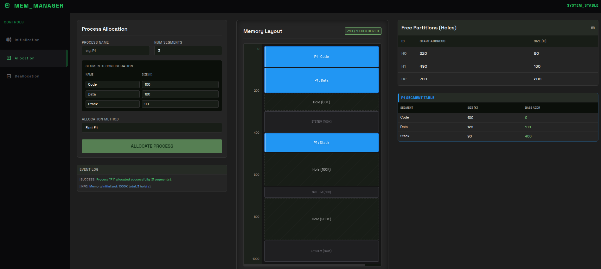
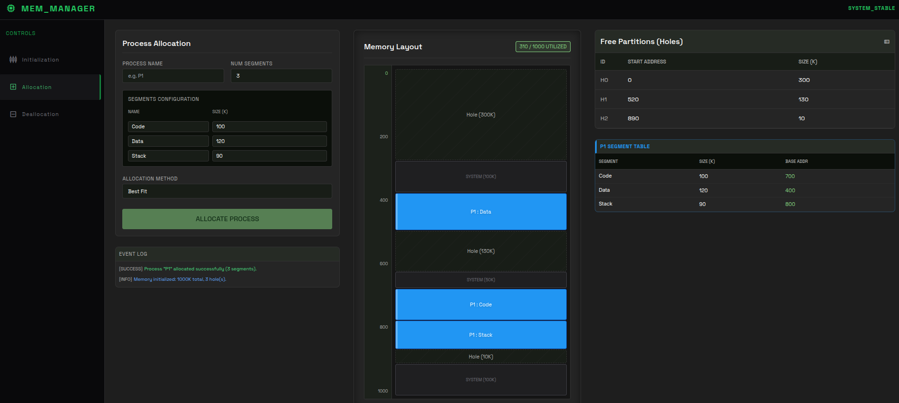
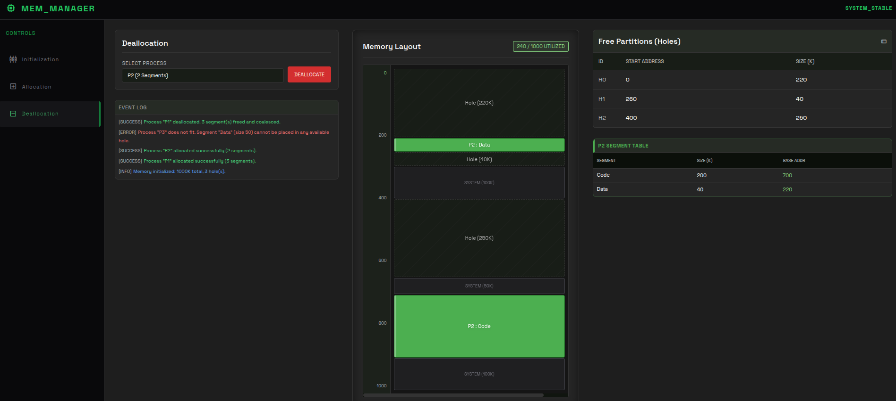
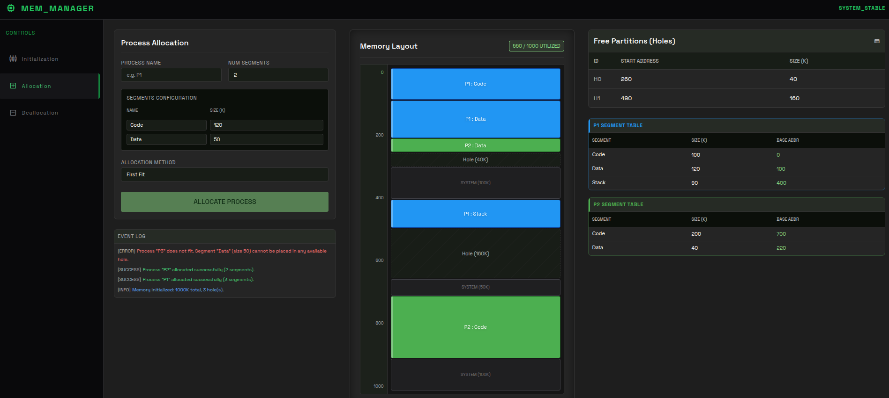

<h1 align="center">OS Memory Segmentation Simulator</h1>

<p align="center">
  <strong>A desktop GUI application that simulates OS memory management using segmentation.</strong>
</p>

<p align="center">
  
  
  
  
  
</p>

<p align="center">
  <a href="https://github.com/Mohamedkhaled687/OS_Memory_Segmentation_Simulator">
    
  </a>
</p>

---

## Table of Contents

- [About](#about)
- [Features](#features)
- [Architecture](#architecture)
- [Screenshots](#screenshots)
- [Getting Started](#getting-started)
- [Project Structure](#project-structure)
- [Allocation Algorithms](#allocation-algorithms)
- [Technologies](#technologies)
- [License](#license)

---

## About

Built for **CSE335s - Operating Systems** at Ain Shams University, Faculty of Engineering. This simulator demonstrates how an OS manages memory using **segmentation** — a scheme where each process is divided into logical segments (Code, Data, Stack) that are independently allocated into free memory partitions (holes).

The application supports **First-Fit** and **Best-Fit** allocation strategies, **transactional allocation** (all-or-nothing), and **automatic coalescing** of adjacent holes upon deallocation.

---

## Features

| Feature | Description |
|---------|-------------|
| **Memory Initialization** | Define total memory and initial free partitions (holes) |
| **First-Fit Allocation** | Allocates in the first hole large enough |
| **Best-Fit Allocation** | Allocates in the smallest sufficient hole |
| **Transactional Rollback** | If any segment fails, the entire process allocation is cancelled |
| **Deallocation + Coalescing** | Freed segments become holes; adjacent holes merge automatically |
| **Live Memory Canvas** | Color-coded real-time visualization of memory layout |
| **Segment Tables** | Per-process tables showing segment name, size, and base address |
| **Free Partitions Table** | Live table of all current holes |
| **Event Logging** | Success/error/info logs for every operation |
| **Desktop App** | Cross-platform via Electron |

---

## Architecture

The project follows a strict **MVVM (Model-View-ViewModel)** pattern:



| Layer | Responsibility | Files |
|-------|---------------|-------|
| **Model** | Pure OS logic — zero UI knowledge | `src/model/types.ts`, `src/model/MemoryManager.ts` |
| **ViewModel** | Bridges Model to View via React hooks | `src/viewmodel/useMemorySimulator.ts` |
| **View** | Renders UI, never calls Model directly | `src/components/*.tsx`, `src/App.tsx` |

### Data Flow

```
User Action → View → ViewModel (Hook) → Model → Result
                ↑                                    |
                └──── setState triggers re-render ←──┘
```

---

## Screenshots

These use paths under `assets/`. **They only render on GitHub after you commit and push those PNG files** (the folder was previously untracked).

### System Initialization
<p align="center">
  
</p>

### Process Allocation (First-Fit)
<p align="center">
  
</p>

### Process Allocation (Best-Fit)
<p align="center">
  
</p>

### Deallocation with Coalescing
<p align="center">
  
</p>

### Allocation Error (Transactional Rollback)
<p align="center">
  
</p>

---

## Getting Started

### Prerequisites

- **Node.js** >= 18
- **npm** >= 9

### Installation

```bash
# Clone the repository
git clone https://github.com/Mohamedkhaled687/OS_Memory_Segmentation_Simulator.git
cd OS_Memory_Segmentation_Simulator

# Install dependencies
npm install
```

### Development

```bash
# Run in browser (hot reload)
npm run dev

# Run as Electron desktop app
npm run dev:electron
```

### Production Build

```bash
# Build for production
npm run build:electron

# Package as .exe / AppImage
npm run package:electron
```

---

## Project Structure

```
OS_Memory_Segmentation_Simulator/
├── electron/
│   ├── main.ts                 # Electron main process
│   └── preload.ts              # Secure context bridge
├── src/
│   ├── model/                  # Pure OS logic (no React)
│   │   ├── types.ts            # TypeScript interfaces
│   │   └── MemoryManager.ts    # First-Fit, Best-Fit, Coalescing
│   ├── viewmodel/              # React state bridge
│   │   └── useMemorySimulator.ts
│   ├── components/             # UI components
│   │   ├── TopAppBar.tsx       # Header with system status
│   │   ├── Sidebar.tsx         # Navigation panel
│   │   ├── InitializationPanel.tsx
│   │   ├── AllocationPanel.tsx
│   │   ├── DeallocationPanel.tsx
│   │   ├── MemoryCanvas.tsx    # Visual memory map
│   │   ├── HolesTable.tsx      # Free partitions table
│   │   ├── ProcessTable.tsx    # Segment tables
│   │   └── LogPanel.tsx        # Event log
│   ├── App.tsx                 # Root component
│   ├── main.tsx                # React entry point
│   └── index.css               # Tailwind + custom styles
├── .github/workflows/
│   └── build.yml               # CI/CD pipeline
├── scripts/
│   └── electron-builder.yml    # Packaging config
├── assets/                     # Images and icons (PNG screenshots — commit these for README images)
├── report/
│   ├── report.tex              # LaTeX source
│   └── report.pdf              # Compiled project report
├── index.html
├── package.json
├── tsconfig.json
├── vite.config.ts
└── tailwind.config.ts
```

---

## Allocation Algorithms

### First-Fit
Scans holes from the lowest address and allocates in the **first** hole that is large enough. Fast but can fragment the beginning of memory.

### Best-Fit
Scans **all** holes and allocates in the **smallest** hole that still fits. Minimizes wasted space per allocation but can create tiny unusable fragments.

### Coalescing
When a process is deallocated, its segments become holes. If two holes are adjacent in memory (`hole.start + hole.size === nextHole.start`), they are merged into one larger hole to combat external fragmentation.

### Test Results Summary

| Operation | First-Fit | Best-Fit |
|-----------|-----------|----------|
| P1 Allocate | ✅ | ✅ |
| P2 Allocate | ✅ | ✅ |
| P3 Allocate | ❌ Fails | ✅ Succeeds |
| P1 Deallocate | ✅ | ✅ |
| P4 Allocate | ✅ Succeeds | ❌ Fails |

> **Key Insight:** No single allocation strategy is universally better. First-Fit is faster but wastes space; Best-Fit minimizes waste but creates tiny fragments.

---

## Technologies

| Technology | Purpose |
|------------|---------|
|  **TypeScript** | Strict type safety for logic and UI |
|  **React 18** | Component-based UI with hooks |
|  **Vite** | Fast build tool with HMR |
|  **Tailwind CSS** | Utility-first dark-theme styling |
|  **Electron** | Desktop wrapper (Chromium + Node.js) |
|  **GitHub Actions** | CI/CD automated build pipeline |

---

## License

This project is licensed under the MIT License. See [LICENSE](LICENSE) for details.

---

<p align="center">
  <strong>Built for CSE335s — Operating Systems</strong><br/>
  <strong>Ain Shams University, Faculty of Engineering</strong><br/><br/>
  <a href="https://github.com/Mohamedkhaled687/OS_Memory_Segmentation_Simulator">
    
  </a>
</p>
